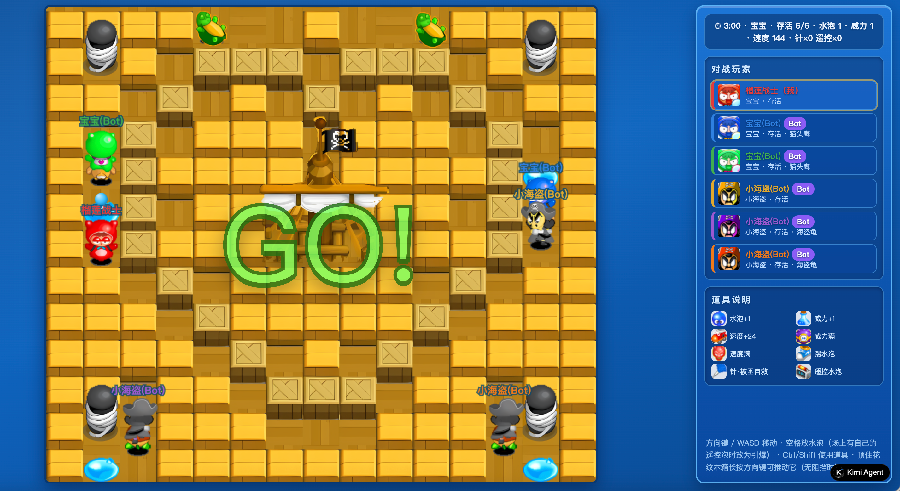

# 泡泡堂之 Kimi K3 满血版

盛大泡泡堂风格的多人网页对战游戏：水蓝色基调，无需账号，输入名字即可建房开战，支持 Bot 补位。



在线试玩：https://h3aajdlti6teq.kimi.site ，无需注册，输入名字即可开战

欢迎使用 K3 复刻更多地图和玩法，发 PR 合并。

## 功能

- **创建/加入房间**：只需一个名字，无需注册；大厅（经典盛大蓝 + 木纹外框，木纹为代码绘制）实时显示房间列表，房卡内嵌「海盗14」地图缩略图
- **大厅个性名片**：按昵称哈希为每位玩家随机搭配盛大的官方道具库素材——背景旗帜头像（12 生肖等）、账号名片特效、去底抠图后的勋章效果小图标，同一玩家观感固定
- **快速加入 / 练习模式**：大厅一键加入首个可进房间；练习模式立即单人开局（Bot 补满 6 人）
- **2 个角色**：房间内可选宝宝/小海盗（原版 4 向行走帧），初始能力与成长上限不同；6 套队伍配色按 slot 分配，同一角色也有不同颜色版本；房间头像色环、对局名字同色
- **开局 321 倒计时**：屏幕中央大数字 3-2-1 + GO!，全员冻结 3 秒，先看清自己的出生位置
- **推箱子**：花纹多的 X 木箱可以用方向键**长按推动**（前方无阻挡时平滑滑到前一格），黄箱/船炮/桅杆不可推动；威力大的水泡也能借此解围
- **丰富道具**：原版掉落体系——威力+1 / 水泡+1 / 速度+24 / 紫魔（威力满值）/ 红魔（速度满值）/ **踢水泡（白鞋，碰到水泡一脚踢走）** / 针（被困自救）/ 遥控器；道具为原版 Gift 三帧动画图标 + 地面投影
- **坐骑系统**：绿乌龟 / 猫头鹰 / 海盗龟 / 飞碟（原版 4 向贴图，移动带两列步态），速度有正有负，被炸时坐骑挡一命
- **默认准备**：加入房间即为准备状态（可取消），全部就绪后房主点击「开始游戏」
- **Bot 补位**：开局时真人不足 6 人自动用 Bot 补齐（Bot 使用随机角色），单人也能开局
- **结算动画**：对局结束弹出胜者立绘 + 彩带 + 对局统计
- **全屏对战界面**：左边游戏地图，右边盛大蓝玩家面板（角色/状态/坐骑/道具 + 道具图例）；被困有原版大水泡包裹动画，死亡水泡炸裂；爆炸为原版十字水花帧；胜/负/平局结算动效 + 官方配音
- **角色移动动画**：宝宝 / 小海盗用原版 4 向 6 帧行走序列（6 套配色），其余 6 角色用立绘行走颠步动画
- **声音**：全局统一音频管理（`client/audio.js` 的 AudioManager）——BGM 严格单轨，按场景切换：登录页 `snd/登录_login.mp3`、大厅/房间 `snd/游戏大厅_lobby_scene.mp3`、对局海盗14 专属 `snd/海盗船_patrit.mp3`；放泡用官方 `snd/放置泡泡_bomb_set.mp3`（本地预检放不出时静默），爆炸/拾取/救困/死亡/胜负全事件配音（官方风格 wav/mp3）；骰子/按钮有点击音效；浏览器自动播放限制下首次交互自动补播；首页 ♪ 按钮为全局静音开关（localStorage 持久化，跨场景生效）
- **经典地图「海盗14」**：按正版截图逐格转录——木地板上棋盘分布黄色木箱与 X 纹木箱（均可炸毁）、四角船炮、中央桅杆海盗旗（贴图逐像素抠自正版截图），无边界墙
- **实时对战**：服务器权威 + WebSocket，30Hz 状态快照，客户端插值渲染
- **房间页（仿盛大经典房间，全屏无滚动）**：左侧 3×2 玩家槽位（房主/已准备状态条），左下聊天（进出房系统提示）+ 固定地图「海盗14」缩略图；右侧当前角色横幅、8 人名册（仅宝宝/小海盗开放，其余灰剪影锁定）、队伍颜色展示，右下大按钮——房主「开始」/ 非房主「准备」
- **房间进场动效**：玩家进房瞬间在其槽位上叠播官方道具库「进场效果」GIF（按 id 随机选款，约 3 秒）

## 角色

名册为拥有原版 4 向行走动画的两名基本角色（6 套队伍配色，不同玩家不同颜色）：

| 角色 | 定位 | 初始速度 | 初始威力 | 初始水泡 | 成长上限（速度/威力/水泡） |
| ---- | ---- | ---- | ---- | ---- | ---- |
| 宝宝 | 速度 | 144（6 级） | 1 | 1 | 240（10 级） / 7 / 6 |
| 小海盗 | 爆破 | 120（5 级） | 2 | 1 | 216（9 级） / 7 / 8 |

> 数值口径：盛大官网角色页只有性格描述、从未公布数值。官方存档值（百度百科角色词条「初始/上限」体系）：宝宝 泡1/威1/速5 → 泡6/威7/速10（「唯一速度满值」口径）；小海盗对应官方隐藏角色「海盗船长」(Lodumani) 泡3/威3/速6 → 泡9/威7/速9。原口径下小海盗早/后期全方位压制宝宝（原版它是随机摇出的隐藏角色，不讲究平衡），上表为**以官方为锚的平衡版**：早期泡数持平（各 1）——早期泡+1 近似开箱效率翻倍（并发双泡加速道具获取、滚雪球），是早期最强增益，不给；海盗只留威力 +1 的小优势（爆炸十字碰箱即止，威 2 主要利于隔箱安全放泡），换回的是宝宝速度快 1 级；后期宝宝极速快 1 级（10>9）、小海盗多 2 个水泡（8>6）、威力同 7，各有专长。速度 1 级 = 24px/s（与鞋子 +24 一致）。

## 道具

拾取即生效：**药**（威力+1）、**泡**（水泡上限+1）、**鞋**（速度+24）、**瓦斯**（大力药，威力max）、**红魔**（跑鞋，速度max）

主动道具（拾取进背包，最多各 2 个，按 **Ctrl**（或 Shift）使用）：
- **针**：被困在水泡里时按 Ctrl，立即自救脱困
- **遥控器**：按 Ctrl 在脚下放出遥控水泡（橙色，不自动爆炸）；场上有自己的遥控泡时按**空格**随时引爆；也会被其他火焰连锁引爆

坐骑（开局地图上就有 6 只，货箱也会掉落；骑上后由坐骑决定移动速度，被炸时坐骑挡一命）：
- **绿乌龟**：很慢（84），多数是坑
- **猫头鹰**：中速（156）
- **海盗龟**：飞快（204）
- **飞碟**：中速（180），能飞越场内障碍（货箱/船体/立柱），但骑乘时捡不到任何道具

## 快速开始

```bash
npm install
npm start          # 默认 3001 端口，PORT=8081 npm start 可改
```

浏览器打开 <http://localhost:3001>。多开几个标签页（各输入不同名字）即可模拟多人：一个建房，其他人从大厅加入。

## 操作

- **移动**：方向键 或 WASD（顶住花纹木箱长按方向键可推动它，前方无阻挡时）
- **放水泡**：空格（场上有自己的遥控水泡时改为引爆它们）
- **使用道具**：Ctrl（或 Shift）——被困时针自救，否则放遥控水泡（消耗遥控器）
- **捡踢水泡（白鞋）后**：走向水泡即可把它踢走一格

## 规则

- 水泡 2.5 秒后十字形爆炸，火焰被墙/船炮/桅杆阻挡，可摧毁两种箱子并连锁引爆其他水泡
- **X 纹木箱可推动**：顶住后长按方向约 0.4 秒向前滑一格（前方格子须无阻挡/水泡/道具/玩家）
- 箱子被炸毁后概率掉落道具；**火焰会烧毁地面上尚未拾取的道具**
- 拾取踢水泡（白鞋）后，走向水泡把它一脚踢飞：水泡沿途滑动，撞上箱子/船炮/桅杆/其他水泡/道具/边界才停下；有坐骑时被火焰炸中：坐骑挡一命（人短暂无敌），再次被炸才会被困
- 被火焰炸中会被困在水泡里 4 秒，期间无法行动；其他玩家触碰可立即戳破；时间到死亡
- 回合限时 3 分钟，超时判平局
- 最后存活的玩家获胜；对局结束自动回到房间
- 对局中断线按死亡处理；房间中断线自动移除，房主离开则移交给下一位玩家

## 技术

- **服务端**（`server/`）：Node.js + `ws`，原生 `http` 托管静态文件，无其他框架
  - `game.js` 游戏引擎（服务器权威，30Hz 固定步长）
  - `bot.js` Bot AI（危险图 + BFS 寻路：逃命 > 放泡 > 捡道具/炸软块/追人，会用针自救、会引爆遥控水泡）
  - `lobby.js` 大厅/房间/准备/选角/聊天/补位/断线处理
  - `characters.js` 角色属性表
  - `mounts.js` 坐骑属性表（绿乌龟/猫头鹰/海盗龟/飞碟）
  - `map.js` 「海盗14」地图
- **客户端**（`client/`）：HTML5 Canvas + 原生 ES Module，无构建步骤
  - `audio.js` 统一音频管理：场景 BGM 单轨切换（登录/大厅/对局三首 mp3，声明式映射表）、音效池（`sfx()` 缓存复用 Audio 节点打断重播）、首次用户手势解锁补播、全局静音持久化；新增音频只调 `audio.playScene()` / `audio.sfx()`，不要自起 `Audio`
  - `characters.js` 8 角色 × 6 配色的精灵图加载（小乖逐像素抠自正版截图，其余为官方 Q 版立绘换色）
  - `render.js` 对局渲染 + 快照插值；地图贴图抠自正版截图；结算动画（胜者立绘 + 彩带 + 对局统计）。性能约定：帧图集源裁切坐标统一乘 `SRC_SCALE`（素材 4× 超分，逻辑尺寸不变）；素材 URL 带 `ASSET_V` 版本串（整批换图时改串绕缓存）；高频子帧走 `SPRITE_CACHE` 预渲染（物理显示尺寸一次性高质量降采样，之后每帧 1:1 blit）；头像走 `characters.js` 的 `AVATAR_CACHE`（对局面板 500ms 重建 DOM 不重复降采样）；开局 321 期间 `decode()` 预热大图
  - 首页双皮肤（`index.html` 顶部脚本随机二选一）：`skin-sea` 原版海底气泡 / `skin-village` 官方「小区」场景复刻（CSS 绘景 + 官网基本角色整版立绘：飞艇/kimi K3 雕像（官方 SVG）/小屋/雨云池塘/光标大手/1P·2P 等）；两套皮肤共用 logo 与登录面板，功能按钮位置一致，仅背景层互换；可用 `#sea` / `#village` 锚点强制指定
- **协议**：WebSocket JSON 消息，见 `server/protocol.js` 注释
- **静态资源**（`client/assets/`）：
  - 地图贴图：箱子/桅杆海盗旗抠自正版「海盗14」截图（`box/crate/mast.png`）；四角船炮用资源包整格切图（`cannon.png`）；
    甲板地板为程序化无缝木板（`floor.png`，无阴影硬边）；被困大水泡（`pic/BigPopo.png` 0-3 帧包裹）、死亡破裂（同图 4-8 帧）
  - 角色精灵（`chars/` 宝宝/小海盗 × 6 配色官方 Q 版立绘）、两角色行走帧图集（`anim/`）；小区皮肤立牌用的官方基本角色整版立绘（`chars/` 胖墩/皮蛋/蓝蓝/葱头，取自官网游戏角色资料页）
  - 道具图标（`pic/Gift*.png` 三帧动画 + `items/` 官网针/遥控器/海盗龟派生）、水泡帧（`popo/`）
  - 爆炸水花（`pic/Explosion.png`）、被困大水泡（`pic/BigPopo.png`）、坐骑 4 向贴图（`pic/Turtle/SlowTurtle/Owl/FastUFO.png`）
  - 倒计时数字（`num/`）、胜负图（`pic/Win.png` `pic/Draw.png` `pic/lose.png`）
  - 事件音效（`snd/`）、胜利配音（`voice/victory.wav`）
  - 参考：`pic/` 与 `snd/` 手工整理自开源 demo [visolleon/bnb](https://github.com/visolleon/bnb)；
    大厅名片/房间进场 GIF（`decor/`）与 `items2/` 图标取自盛大官网道具图标包；
    首页漂浮道具泡的图标取自 `pic/Gift*.png` 三帧条带切出的中间帧（`items2/`，天然透明）

## 素材资源

图片与音频集中在 `client/assets/`（浏览器以 `/assets/...` 访问）：

- `assets/pic/`（20 张）— 泡泡堂原版风格 PNG：角色死亡序列帧、被困大水泡、四方向爆炸水花、道具三帧条带、坐骑贴图、结算标题图、礼物/角色阴影等
- `assets/snd/`（13 个）— 原版音效：`explode`（爆炸）、`save`（救人）、`role_die.mp3`（水泡破裂/阵亡）、`lose`/`draw`（负/平）、`get`（拾取）、`start`、`victory.wav`（胜利）、`放置泡泡_bomb_set.mp3`（放泡）、`appear`，外加 3 首场景 BGM：`登录_login.mp3`（首页）、`游戏大厅_lobby_scene.mp3`（大厅/房间）、`海盗船_patrit.mp3`（对局）

## 测试

```bash
npm test
```

- `test/game.test.js`：引擎单测（地图、爆炸/连锁/道具、道具烧毁、被困/死亡/胜负、8 角色、针自救、遥控水泡、加强道具）
- `test/smoke.test.js`：端到端（起服务 → 双客户端建房/进房/选角/准备/开局 → Bot 补位与快照/输入/放泡断言）

## 致谢

- 素材来源：开源 H5 泡泡堂 demo [visolleon/bnb](https://github.com/visolleon/bnb)（作者 Wang Yu Xiang）——`assets/pic/` 与 `assets/snd/` 全部取自该项目；另有部分音效经 [SineYuan/BnBonline](https://github.com/SineYuan/BnBonline) 镜像、`defeat.wav` 取自 [NPpj/CrazyArcade](https://github.com/NPpj/CrazyArcade)
- 素材版权：《泡泡堂》原作素材版权归 盛趣游戏（原盛大网络）/ Nexon 所有，本项目仅作学习和研究用途
